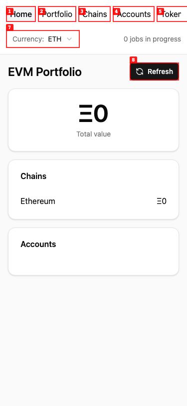
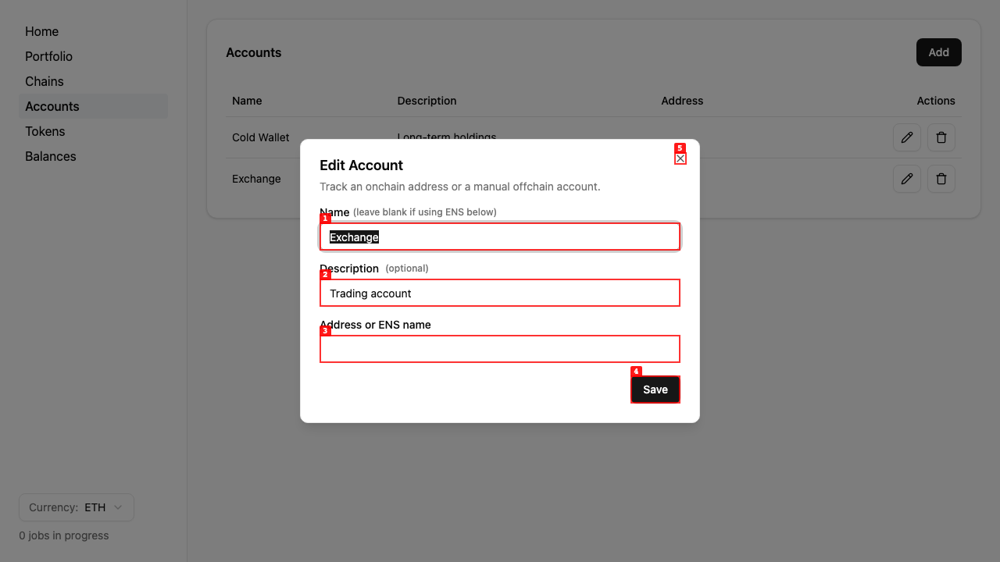
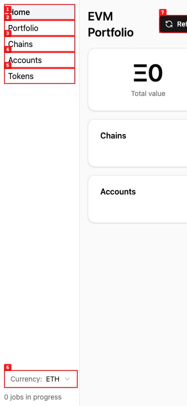
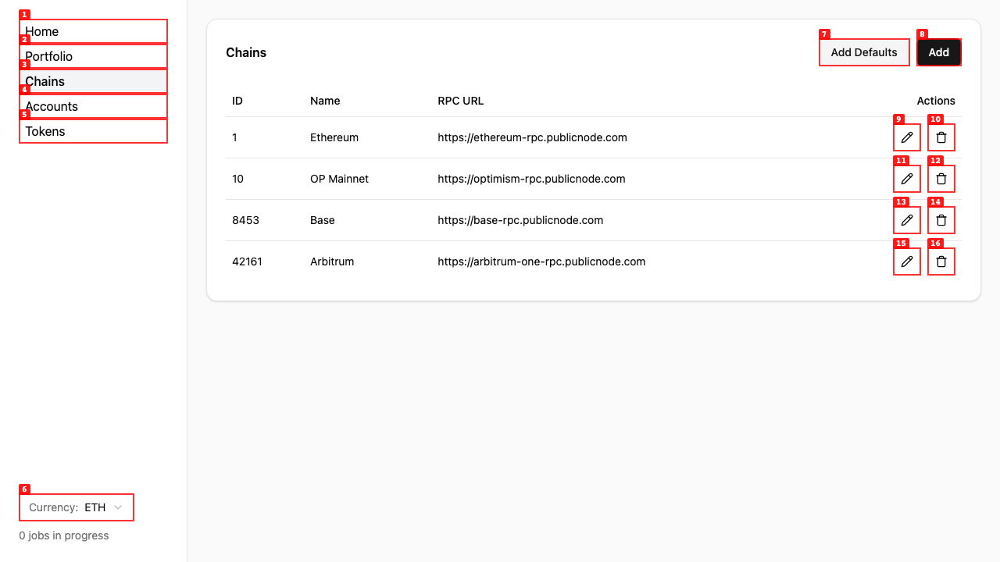
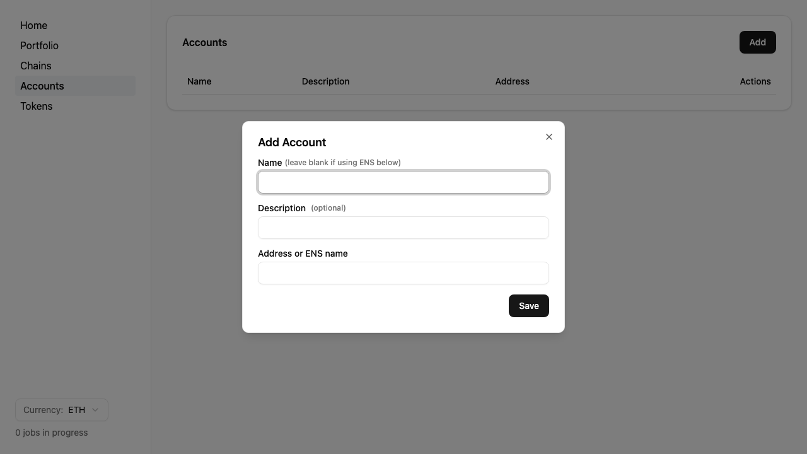
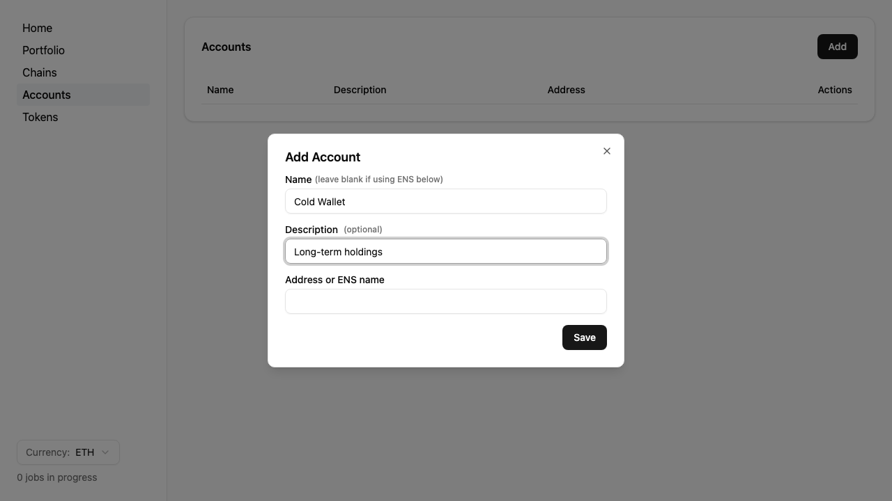
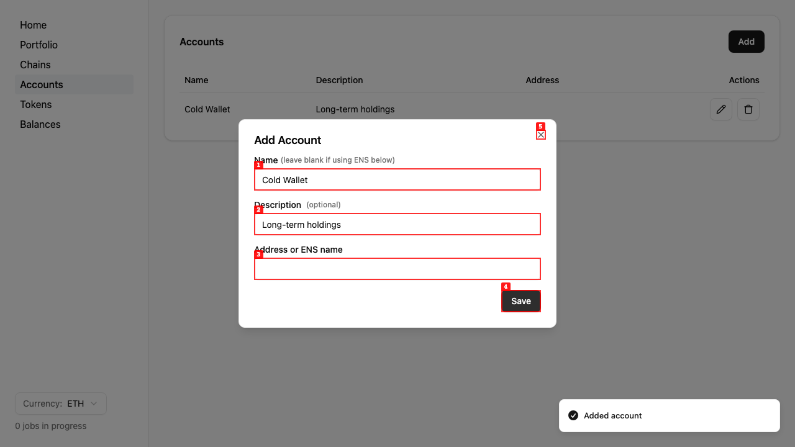
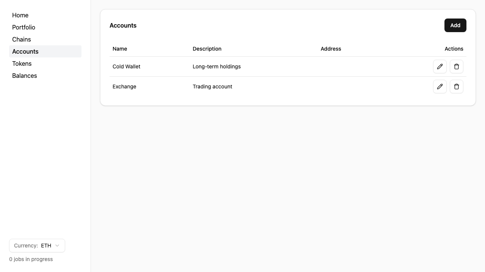
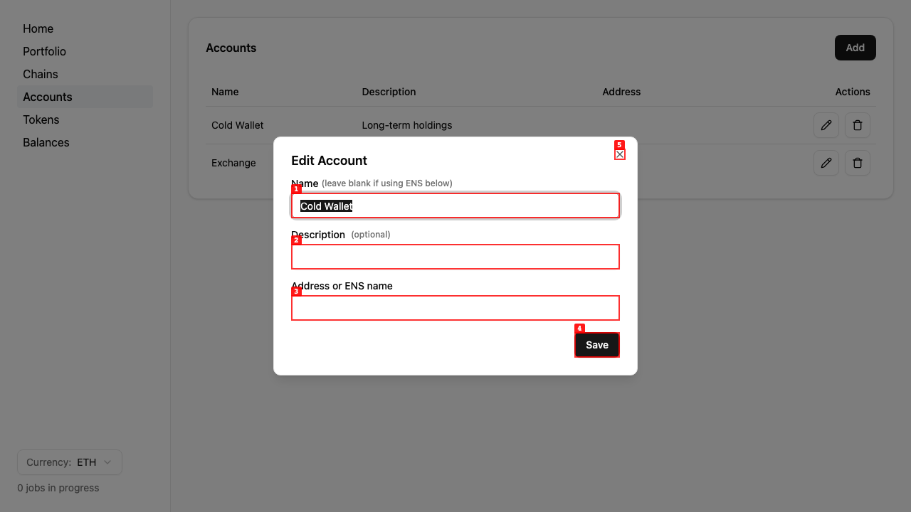

# Dogfood Report: EVM Portfolio Tracker

| Field       | Value                                  |
| ----------- | -------------------------------------- |
| **Date**    | 2026-08-20                             |
| **App URL** | http://127.0.0.1:8580                  |
| **Session** | local-eth-accounting                   |
| **Scope**   | Full app, desktop and mobile viewports |

## Summary

| Severity  | Count |
| --------- | ----- |
| Critical  | 0     |
| High      | 1     |
| Medium    | 3     |
| Low       | 0     |
| **Total** | **4** |

## Verification after fixes

All four findings were addressed and rechecked against the rebuilt production client:

- The 375 × 812 layout now uses a compact, horizontally scrollable header and gives the main content the full viewport width.
  
- Table actions now expose record-specific accessible names, and form labels resolve to their controls.
- Successful submissions close their dialogs.
- Editing “Exchange” now loads “Exchange” and preserves “Trading account,” rather than selecting the first manual account.
  

## Issues

### ISSUE-001: Fixed sidebar makes phone layouts unusably narrow

| Field           | Value                  |
| --------------- | ---------------------- |
| **Severity**    | medium                 |
| **Category**    | visual / responsive    |
| **URL**         | http://127.0.0.1:8580/ |
| **Repro Video** | N/A                    |

**Description**

At a 375 × 812 phone viewport, the permanently visible 160px sidebar leaves only about 215px for the main content. The page title wraps, the Refresh button is clipped off-screen, cards are squeezed, and the layout requires horizontal scrolling. The navigation should collapse into a compact mobile header or otherwise move out of the content column.

**Repro Steps**

1. Open the home page at a 375 × 812 viewport and observe the clipped main content and Refresh button.
   

---

### ISSUE-002: Icon-only edit and delete actions have no accessible names

| Field           | Value                        |
| --------------- | ---------------------------- |
| **Severity**    | medium                       |
| **Category**    | accessibility                |
| **URL**         | http://127.0.0.1:8580/chains |
| **Repro Video** | N/A                          |

**Description**

The edit and delete controls in data tables are exposed only as unnamed “button” elements in the accessibility tree. Screen-reader users cannot tell the actions apart, and sighted users receive no tooltip or other text cue. Each control should have a record-specific accessible label such as “Edit Ethereum chain” or “Delete Ethereum chain.” The same pattern appears on Accounts, Tokens, and Balances.

**Repro Steps**

1. Open the populated Chains page and inspect the icon-only controls; annotations 9–16 have no accessible names.
   

---

### ISSUE-003: Successful form submission leaves the dialog open and populated

| Field           | Value                          |
| --------------- | ------------------------------ |
| **Severity**    | medium                         |
| **Category**    | ux / functional                |
| **URL**         | http://127.0.0.1:8580/accounts |
| **Repro Video** | videos/issue-003-repro-2.webm  |

**Description**

After an account is successfully created, the success toast appears but the modal stays open with all submitted values still present. This makes the action look unfinished and allows accidental duplicate submissions. Add/edit dialogs should close on success (and reset when appropriate). The same uncontrolled-dialog pattern is used by the Chain, Token, and Balance forms.

**Repro Steps**

1. Open Add Account.
   

2. Enter a name and description.
   

3. Submit the form and observe that the success toast appears while the populated modal remains open.
   

---

### ISSUE-004: Editing any manual account targets the first manual account

| Field           | Value                          |
| --------------- | ------------------------------ |
| **Severity**    | high                           |
| **Category**    | functional                     |
| **URL**         | http://127.0.0.1:8580/accounts |
| **Repro Video** | videos/issue-004-repro.webm    |

**Description**

Manual accounts all have a null address, but the edit dialog locates its record by address. When more than one manual account exists, clicking Edit on any of them selects the first account and submits that first account's hidden ID. This can silently overwrite the wrong account. The description is also not prefilled, so saving an edit clears it. Records must be selected by their unique account ID and every editable field must be initialized.

**Repro Steps**

1. Create two manual accounts, “Cold Wallet” and “Exchange,” then open the Accounts page.
   

2. Click Edit on the second row (“Exchange”).

3. **Observe:** the dialog is populated with the first row's name (“Cold Wallet”), and its saved description is blank.
   

---
